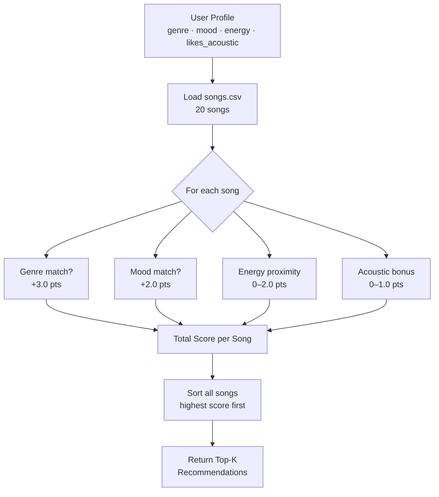

# 🎵 Music Recommender Simulation

## Project Summary

In this project you will build and explain a small music recommender system.

Your goal is to:

- Represent songs and a user "taste profile" as data
- Design a scoring rule that turns that data into recommendations
- Evaluate what your system gets right and wrong
- Reflect on how this mirrors real world AI recommenders

This simulation builds a content-based music recommender in Python. It represents songs and a user taste profile as data objects, scores each song using weighted rules based on genre, mood, and energy, and returns a ranked list of top recommendations. The goal is to mirror how real platforms like Spotify decide what to suggest next, but in a small, transparent, and explainable way.

---

## How The System Works

Real-world platforms like Spotify combine two approaches: **collaborative filtering** (recommending based on what similar users listened to) and **content-based filtering** (matching song attributes to your preferences). This simulation focuses on content-based filtering — no user history needed.

### Song Features

Each `Song` object stores:

| Feature | Type | Description |
|---------|------|-------------|
| `genre` | string | Musical genre (pop, lofi, rock, jazz, metal, etc.) |
| `mood` | string | Listening context (happy, chill, intense, moody, etc.) |
| `energy` | float 0–1 | How active or driving the song feels |
| `tempo_bpm` | float | Beats per minute |
| `valence` | float 0–1 | Musical positivity/brightness |
| `danceability` | float 0–1 | How suitable the track is for dancing |
| `acousticness` | float 0–1 | Organic/acoustic vs. electronic |

The catalog (`data/songs.csv`) contains **20 songs** spanning pop, lofi, rock, jazz, electronic, classical, country, folk, r&b, punk, metal, ambient, synthwave, and world music.

### User Profile

Each `UserProfile` stores:
- `favorite_genre` — preferred genre string
- `favorite_mood` — preferred mood string
- `target_energy` — ideal energy level (0.0–1.0)
- `likes_acoustic` — boolean preference for acoustic tracks

### Algorithm Recipe (Scoring Rule)

The `Recommender` assigns a score to every song in the catalog:

```
score = 0
if song.genre == user.favorite_genre:          score += 3.0   # genre match (highest weight)
if song.mood  == user.favorite_mood:           score += 2.0   # mood match
score += (1 - |song.energy - user.target_energy|) * 2.0       # energy proximity (0–2 pts)
if user.likes_acoustic:
    score += song.acousticness * 1.0                          # acoustic bonus (0–1 pts)
```

**Max possible score: 8.0.** Songs are sorted highest-to-lowest and the top-k are returned.

**Why these weights?** Genre is weighted highest (3.0) because it's the broadest taste signal. Mood (2.0) captures listening context. Energy proximity rewards closeness, not just high or low values — a user wanting energy=0.4 is penalized for energy=0.9. Acousticness is optional and lower-weighted since it's a secondary preference.

> **Expected bias:** Because genre has the highest weight, users with a rare genre in the catalog (e.g., classical) will hit a ceiling faster than pop or lofi listeners who have more matching songs. This may cause the system to over-recommend within popular genres.

### Data Flow



---

## Getting Started

### Setup

1. Create a virtual environment (optional but recommended):

   ```bash
   python -m venv .venv
   source .venv/bin/activate      # Mac or Linux
   .venv\Scripts\activate         # Windows

2. Install dependencies

```bash
pip install -r requirements.txt
```

3. Run the app:

```bash
python -m src.main
```

### Running Tests

Run the starter tests with:

```bash
pytest
```

You can add more tests in `tests/test_recommender.py`.

---

## Experiments You Tried

Four user profiles were tested. Terminal output for each is shown below.

**Profile results summary:**

| Profile | #1 Result | Score | Notes |
|---------|-----------|-------|-------|
| High-Energy Pop (genre=pop, mood=happy, energy=0.85) | Sunrise City | 6.94 | All 3 main features matched — intuitive top pick |
| Chill Lofi (genre=lofi, mood=chill, energy=0.38, acoustic=True) | Library Rain | 7.80 | Highest score of any run; acoustic bonus pushed it above Midnight Coding |
| Deep Intense Rock (genre=rock, mood=intense, energy=0.92) | Storm Runner | 6.98 | Only rock song in catalog — immediately #1, no competition |
| Edge Case — ambient + peaceful + energy=0.95 | Soft Thunder | 3.76 | Scores were low across the board; conflicting prefs degraded all results |

**Experiment 1 — Weight shift (genre halved, energy doubled):**
- Genre weight: 3.0 → 1.5 | Energy proximity weight: 2.0 → 4.0
- For the pop/happy/0.85 profile, Sunrise City stayed #1 but Rooftop Lights jumped from #3 to #2, pushing Gym Hero down
- Finding: Rooftop Lights is actually a better energy match than Gym Hero; original weights were hiding this by over-rewarding genre loyalty
- Conclusion: doubling energy weight produces more "vibe-accurate" results but weakens genre coherence

**Experiment 2 — Edge case (conflicting preferences):**
- Profile: ambient genre + peaceful mood + energy=0.95 (ambient songs are inherently low-energy)
- Top result was Soft Thunder at only 3.76 — the system silently produced incoherent recommendations
- Finding: the system has no way to detect or flag contradictory user preferences; it just calculates and returns

**Gym Hero keeps appearing across profiles:**
Gym Hero (pop, intense, energy=0.93) appeared in both the High-Energy Pop list (#2) and the Deep Intense Rock list (#2). It earns genre points from pop users and mood+energy points from rock users — but it is not a rock song. A real listener wanting intense rock would not want a pop gym track. This is a direct symptom of a small catalog combined with high energy proximity weight.

---

## Limitations and Risks

- Genre and mood comparisons are exact string matches — "pop" and "indie pop" score zero genre overlap even though they are closely related styles
- High genre weight (3.0 pts) creates a filter bubble: users reliably see only their stated genre at the top, even when songs from other genres are a better vibe match
- Niche genres (classical, country, folk, metal) have only 1–2 songs each; users who prefer them hit a ceiling quickly and get irrelevant filler recommendations
- No diversity enforcement — the same artist can appear multiple times in one top-5 list (e.g., LoRoom at #2 and #3 for Chill Lofi)
- Conflicting preferences (high energy + peaceful mood) are silently accepted and produce incoherent results with no warning to the user
- No listening history — the system resets completely each run and cannot learn from past behavior

---

## Reflection

Read and complete `model_card.md`:

[**Model Card**](model_card.md)

Read and complete `model_card.md`:

[**Model Card**](model_card.md)

Building VibeFinder made clear how much consequential work happens *before* any algorithm runs. Choosing which features to weight, and by how much, shapes who the system serves well and who it underserves. Giving genre a weight of 3.0 felt natural because that is how most people describe their taste — but it is also the single decision that creates the filter bubble. The system ends up confirming what users already said they like instead of helping them discover something new.

The edge-case experiment was the most instructive. Asking for ambient + peaceful + energy=0.95 produced recommendations that were logically consistent (the algorithm followed its rules) but practically useless. That gap — between "the code did what it was told" and "the user got something helpful" — is where most real AI failures live. A better system would detect that peaceful and 0.95 energy are contradictory and ask the user to clarify, rather than silently returning a bad list.


---

## 7. `model_card_template.md`

Combines reflection and model card framing from the Module 3 guidance. :contentReference[oaicite:2]{index=2}  

```markdown
# 🎧 Model Card - Music Recommender Simulation

## 1. Model Name

Give your recommender a name, for example:

> VibeFinder 1.0

---

## 2. Intended Use

- What is this system trying to do
- Who is it for

Example:

> This model suggests 3 to 5 songs from a small catalog based on a user's preferred genre, mood, and energy level. It is for classroom exploration only, not for real users.

---

## 3. How It Works (Short Explanation)

Describe your scoring logic in plain language.

- What features of each song does it consider
- What information about the user does it use
- How does it turn those into a number

Try to avoid code in this section, treat it like an explanation to a non programmer.

---

## 4. Data

Describe your dataset.

- How many songs are in `data/songs.csv`
- Did you add or remove any songs
- What kinds of genres or moods are represented
- Whose taste does this data mostly reflect

---

## 5. Strengths

Where does your recommender work well

You can think about:
- Situations where the top results "felt right"
- Particular user profiles it served well
- Simplicity or transparency benefits

---

## 6. Limitations and Bias

Where does your recommender struggle

Some prompts:
- Does it ignore some genres or moods
- Does it treat all users as if they have the same taste shape
- Is it biased toward high energy or one genre by default
- How could this be unfair if used in a real product

---

## 7. Evaluation

How did you check your system

Examples:
- You tried multiple user profiles and wrote down whether the results matched your expectations
- You compared your simulation to what a real app like Spotify or YouTube tends to recommend
- You wrote tests for your scoring logic

You do not need a numeric metric, but if you used one, explain what it measures.

---

## 8. Future Work

If you had more time, how would you improve this recommender

Examples:

- Add support for multiple users and "group vibe" recommendations
- Balance diversity of songs instead of always picking the closest match
- Use more features, like tempo ranges or lyric themes

---

## 9. Personal Reflection

A few sentences about what you learned:

- What surprised you about how your system behaved
- How did building this change how you think about real music recommenders
- Where do you think human judgment still matters, even if the model seems "smart"

