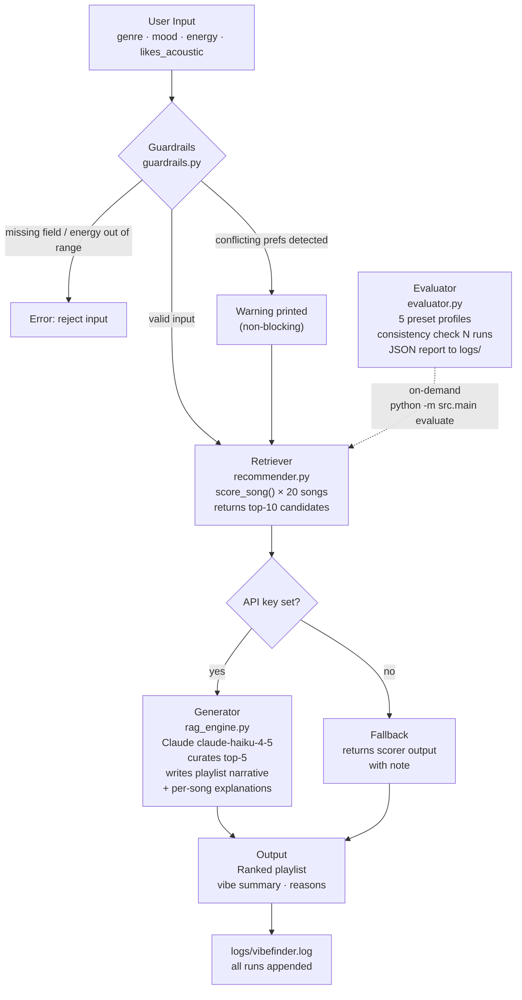

# VibeFinder — System Architecture Diagram

Paste the Mermaid code below into https://mermaid.live, then export as PNG
and save it as `assets/system_architecture.png`.

```mermaid
flowchart TD
    A["User Input\ngenre · mood · energy · likes_acoustic"] --> B

    B{"Guardrails\nguardrails.py"}
    B -- "missing field / energy out of range" --> ERR["Error: reject input"]
    B -- "conflicting prefs detected" --> WARN["Warning printed\n(non-blocking)"]
    B -- "valid input" --> C
    WARN --> C

    C["Retriever\nrecommender.py\nscore_song() × 20 songs\nreturns top-10 candidates"]

    C --> D{"API key set?"}
    D -- "yes" --> E["Generator\nrag_engine.py\nClaude claude-haiku-4-5\ncurates top-5\nwrites playlist narrative\n+ per-song explanations"]
    D -- "no" --> F["Fallback\nreturns scorer output\nwith note"]

    E --> G["Output\nRanked playlist\nvibe summary · reasons"]
    F --> G

    G --> H["logs/vibefinder.log\nall runs appended"]

    I["Evaluator\nevaluator.py\n5 preset profiles\nconsistency check N runs\nJSON report to logs/"] -.->|"on-demand\npython -m src.main evaluate"| C
```
